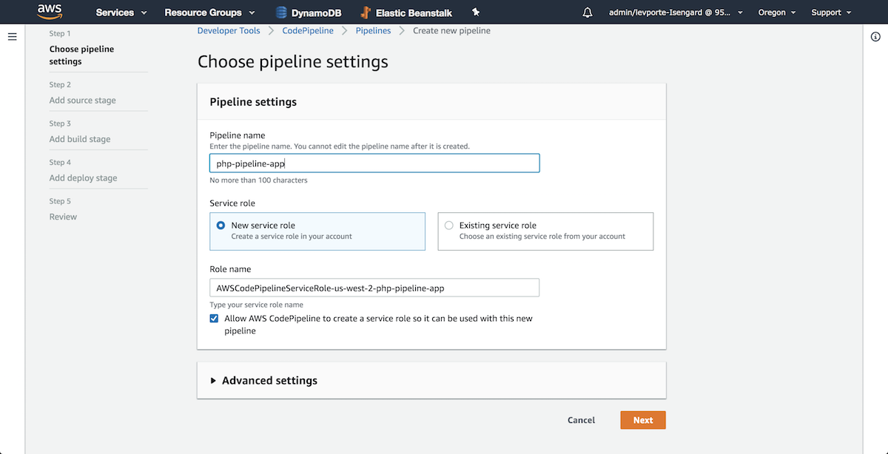
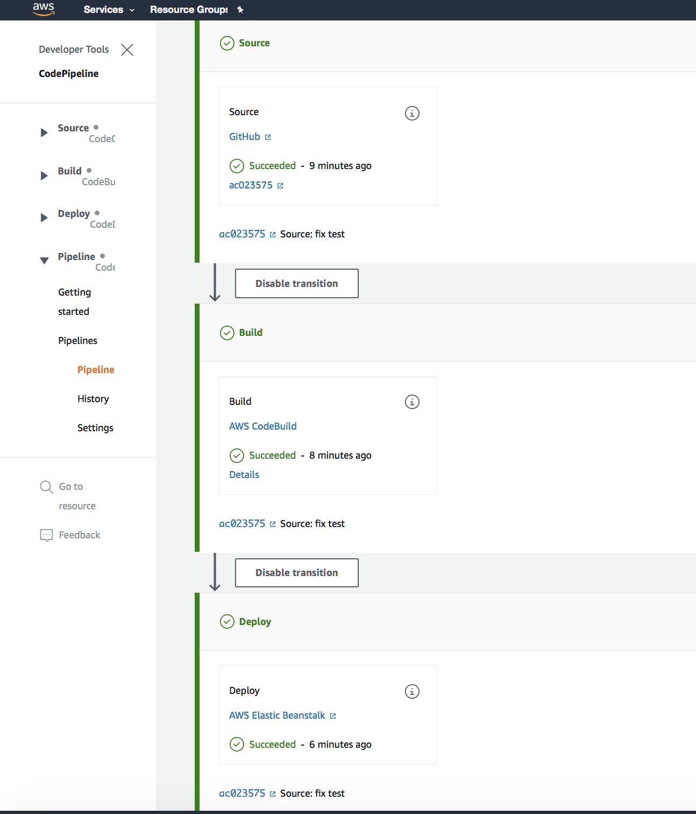

# php-pipeline-app

## Team Members
- Levi
- Anthony
- Will
- Charles

## Deployed Link
- [Deployed](http://deploymentappphp-env.tbujpmnwaa.us-west-2.elasticbeanstalk.com)

## How to Deploy

### Elastic Beanstalk
- Open the AWS Elastic Beanstalk console.
- Select Create new Application.
- Give your app a name, choose region, select platform (PHP), select sample application and click create.

### Code Pipeline

- On your AWS CodePipeline console click create pipeline.
- Choose a pipeline name, select new service role and click next.
- Choose source provider (GitHub) and connect to GitHub by providing your credentials.
- Choose the repository and the branch that you want to deploy.
- Select use GitHub webhooks and click next.
- SEE AWS CODE BUILD INSTRUCTIONS
- Choose deploy provider (Elastic Beanstalk)
  - choose the region
  - application name
  - environment name(should auto-populate)
  - Artifact: Source artifact
  - click next.
- Click create pipeline.

### AWS Code Build
- Create Code Build Project
- Project Name: php-pipeline-app
- description: add a description
- Source: no source
- Enviroment
  - Enviroment: Managed Image
  - Operating System: Ubuntu
  - Runtime: Standard
  - Image: aws/codebuild/standard: 1.0
  - Image Version:
  - Priveleged: unchecked
  - Service Role: New Service Role
- BuildSpec
  - Insert Build Command: Insert Build commands
  - switch to editor: enter the buildspec.yml text from repo
- Artifacts
  - Type: No Artifacts
- Logs
  - CloudWatch Logs: checked
- Create Build - push the button
- RETURN TO AWS CODEPIPELINE INSTRUCTIONS AND CONTINUE AFTER THE AWS CODEBUILD STEP

### Issues
- EC2 Instance limit
- Input artifacts on codepipeline deploy

### References
- [deployment-app-php](https://github.com/sadhikari07/deployment-app-php) 